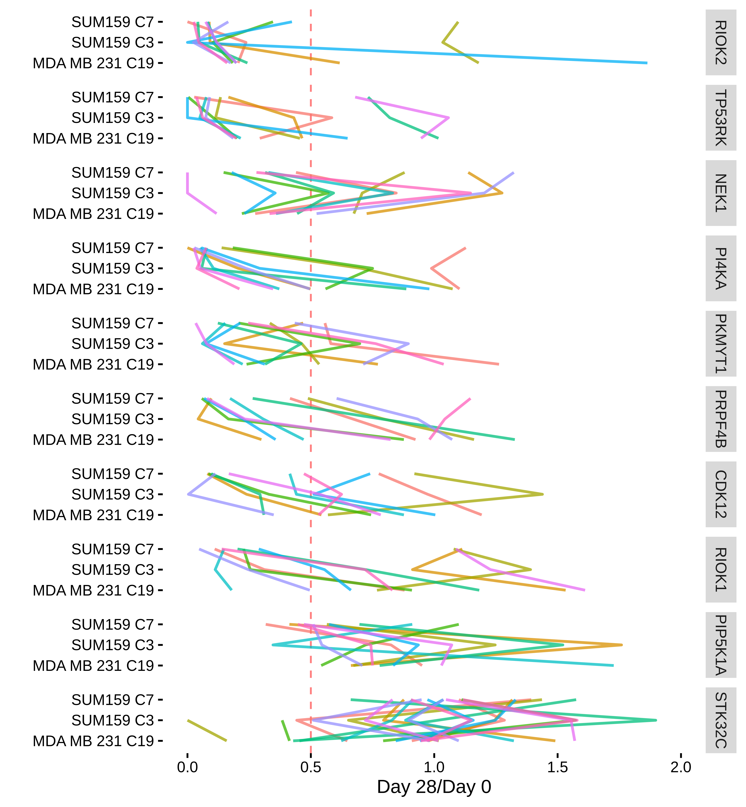

Combined CRISPRi Dropout Analysis
================

Taking a look a the set of hits from the CRISPRi screen.

Loading Data
============

This bit of code reads in the processed read count data, which was created in the other R notebooks for each experiment. Then combines the data and produces some ordering lists for the next few figures.

``` r
alignments_files = Sys.glob(here('*/read_counts.rds'))
all_reads = read_rds(alignments_files[1])
for (this_file in alignments_files[-1]) {
  all_reads <- rbind(all_reads, read_rds(this_file))
}

dropout_hits = Sys.glob(here('*/dropout_hits.rds'))
all_dropout = read_rds(dropout_hits[1])
for (this_file in dropout_hits[-1]) {
  all_dropout <- rbind(all_dropout, read_rds(this_file))
}

all_reads_summary = all_reads %>% 
  filter(Day != 0) %>%
  group_by(gene_name,Day,cell_line) %>%
  summarise(D0_ratio_average = mean(D0_ratio))

all_dropout_filt = all_dropout %>% filter(number_below_2fold >= 4)

dropout_order = all_dropout_filt %>% 
  group_by(gene_name) %>% 
  summarise(average_below = mean(number_below_2fold)) %>% 
  arrange(desc(average_below))

all_dropout_order = all_dropout %>% 
  group_by(gene_name) %>% 
  summarise(average_below = mean(number_below_2fold)) %>% 
  arrange(desc(average_below))
```

Dropout CRISPRi Visualization
=============================

OK, looking at the guides where at least one of the cell lines has 4 guides past the 2-fold drop line, here is a figure that shows the performance of each guide in each of the experiments.

``` r
dropout_reads = all_reads %>% 
  filter(gene_name %in% unique(all_dropout_filt$gene_name), Day == 28) %>% 
  mutate(exp_name = paste0(cell_line,' C', clone)) %>%
  filter(D0_ratio <= 2) %>%
  mutate(ID = str_extract(gene_name_plus_id,"[^_]*?_[^_]*?$"))

dropout_reads$gene_name = factor(dropout_reads$gene_name, levels = dropout_order$gene_name)

ggplot(dropout_reads, aes(x=D0_ratio,y=exp_name, group=Name)) + 
  geom_vline(xintercept=0.5, color='red', alpha=0.5,linetype=2) +
  geom_path(aes(color=ID),alpha=0.75) +
  theme_berginski() +
  xlim(c(0,2)) +
  theme(legend.position = "none") +
  labs(y="",x="Day 28/Day 0") +
  facet_grid(vars(gene_name))
```



The colors in each individual plot show a single guide sequence in all of the experiments. The genes are ordered by the average number of guide sequences below a 2-fold drop.

Another Vis of the Dropout Percentages
======================================

Same visualizaiton as above, only with the minimum number of guides set to 2 instead.

``` r
dropout_reads = all_reads %>% 
  filter(gene_name %in% unique(all_dropout$gene_name), Day == 28) %>% 
  mutate(exp_name = paste0(cell_line,' C', clone)) %>%
  filter(D0_ratio <= 2) %>%
  mutate(ID = str_extract(gene_name_plus_id,"[^_]*?_[^_]*?$"))

dropout_reads$gene_name = factor(dropout_reads$gene_name, levels = all_dropout_order$gene_name)

ggplot(dropout_reads, aes(x=D0_ratio,y=exp_name, group=Name)) + 
  geom_vline(xintercept=0.5, color='red', alpha=0.5,linetype=2) +
  geom_path(aes(color=ID),alpha=0.75) +
  theme_berginski() +
  xlim(c(0,2)) +
  theme(legend.position = "none") +
  labs(y="",x="Day 28/Day 0") +
  facet_grid(vars(gene_name))
```


