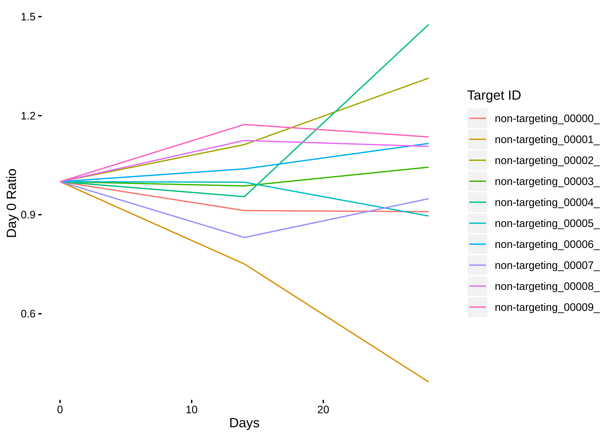
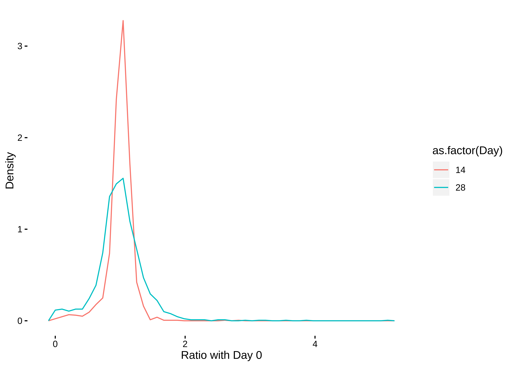

SUM 159 Clone 3 CRISPRi Analysis
================

Taking a look at the CRISPRi screen for the dark kinases in SUM 159 cells.

Loading Data
============

``` r
alignments  = rbind(
  read.delim(here('DK_SUM159_C3/salmon_output/SUM159_C3_D0_S1_R1_001.fastq.gz/quant.sf')) %>%
    mutate(Day = 0, Clone = 3),
  read.delim(here('DK_SUM159_C3/salmon_output/SUM159_C3_D14_S2_R1_001.fastq.gz/quant.sf')) %>%
    mutate(Day = 14, Clone = 3),
  read.delim(here('DK_SUM159_C3/salmon_output/SUM159_C3_D28_S3_R1_001.fastq.gz/quant.sf')) %>%
    mutate(Day = 28, Clone = 3)
) %>% mutate(gene_name = str_extract(Name,"[^_]*"), gene_name_plus_id = str_extract(Name,"[^_]*_[^_]*_[^_]*"))
```

Calculations and Conversions
============================

The number of reads observed for each day is variable, so instead of doing the downstream calculations on the read count, we will instead convert these into the percentage of reads from that day. We'll also pick out the percentage of reads from Day 0 and use that to calculate the shifts in reads between Day 0 and Day 14/28.

``` r
#Count the total reads per day, we will use this correct for the depth of sequencing coverage
alignments = alignments %>%
  group_by(Day, Clone) %>%
  summarise(total_reads = sum(NumReads)) %>%
  select(Day,Clone,total_reads) %>%
  left_join(alignments) %>%
  mutate(Percentage_reads = NumReads/total_reads)
```

    ## Joining, by = c("Day", "Clone")

``` r
#Pick out the first day reads and determine the ratio of first day to other days
alignments = alignments %>%
  filter(Day == 0) %>%
  rename(Percentage_reads_D0 = Percentage_reads) %>%
  ungroup() %>%
  select(Name,Percentage_reads_D0) %>%
  left_join(alignments) %>%
  mutate(D0_ratio = Percentage_reads/Percentage_reads_D0)
```

    ## Joining, by = "Name"

``` r
write_rds(alignments,here('DK_SUM159_C3/read_counts.rds'))
```

Non-target Analysis
===================

With the ratios calculated, my next step is to take a look at the non-targetting sequences. These sequences shouldn't be targetting any genetic locus and so can act as a negative control for the other targeting sequences.

``` r
non_target_counts = alignments %>% filter(gene_name == "non-targeting")

ggplot(non_target_counts, aes(x=Day,y=Percentage_reads, color=gene_name_plus_id)) + 
  geom_line() + theme_berginski() + labs(x="Days",y="Percentage of Total Reads",color="Target ID")
```


The raw percentage counts look good, all roughly stable without any changes. Let's look at the ratios with day 0.

``` r
ggplot(non_target_counts, aes(x=Day,y=D0_ratio, color=gene_name_plus_id)) + 
  geom_line() + theme_berginski() + labs(x="Days",y="Day 0 Ratio",color="Target ID")
```



``` r
ggplot(non_target_counts, aes(x=as.factor(Day),y=D0_ratio)) + 
  geom_boxplot() + theme_berginski() + labs(x="Days",y="Day 0 Ratio")
```


One last point, let's look at the confidence intervals for the ratio values. I'll use the bootstrap confidence interval.

``` r
non_target_conf = non_target_counts %>% 
  #Toss out day one as the ratios are meaningless there
  filter(Day != 0) %>% 
  group_by(Day) %>% 
  summarise(boot.low = boot.ci(boot(D0_ratio, function(data,index) {mean(data[index])}, 10000), type="bca", conf=0.95)$bca[4],
            boot.high = boot.ci(boot(D0_ratio, function(data,index) {mean(data[index])}, 10000), type="bca", conf=0.95)$bca[5],
            quantile.low = boot.ci(boot(D0_ratio, function(data,index) {quantile(data[index],c(0.05))}, 10000), type="bca", conf=0.0001)$bca[4])

non_target_conf %>%
  kable()
```

<table>
<thead>
<tr>
<th style="text-align:right;">
Day
</th>
<th style="text-align:right;">
boot.low
</th>
<th style="text-align:right;">
boot.high
</th>
<th style="text-align:right;">
quantile.low
</th>
</tr>
</thead>
<tbody>
<tr>
<td style="text-align:right;">
14
</td>
<td style="text-align:right;">
0.9025438
</td>
<td style="text-align:right;">
1.059290
</td>
<td style="text-align:right;">
0.7507311
</td>
</tr>
<tr>
<td style="text-align:right;">
28
</td>
<td style="text-align:right;">
0.8232606
</td>
<td style="text-align:right;">
1.178234
</td>
<td style="text-align:right;">
0.3933474
</td>
</tr>
</tbody>
</table>
OK, this looks good, the confidence intervals include 1. Let's move onto the rest of the data.

Gene Ratio Values
=================

As a first pass, let's take a look at the distribution of day 0 ratios for both day 14 and 28.

``` r
#remove the non-targeting alignments and day zero ratios
alignments_gene = alignments %>% filter(gene_name != "non-targeting" & Day != 0)
ggplot(alignments_gene, aes(x=D0_ratio, y = stat(density), color=as.factor(Day))) + 
  geom_freqpoly(bins=50) + theme_berginski() +
  labs(x="Ratio with Day 0",y="Density")
```

 Looks like the spread increases by day 28, which should be expected due to each of the sequences having more time to act on the growth phenotype. Is there are a relationship between the ratios at day 14 and 28?

``` r
alignments_day_comp = alignments_gene %>% select(Name,Day,D0_ratio,gene_name_plus_id) %>% spread(Day,D0_ratio,sep="_")
ggplot(alignments_day_comp, aes(x=Day_14,y=Day_28)) + 
  geom_point(alpha=0.1) + geom_density2d() + geom_smooth(method="lm") +
  theme_berginski() +
  labs(x ="Day 14/Day 0", y="Day 28/Day 0")
```


I'm not sure how correlated I expected this to be, but the 0.61 value seems a bit low, but maybe that's just par for this type of data.

Determining the Screening Hits
==============================

There is no fixed method for determining which genes are "hits" given the ratios observed. This difficulty is compounded by the fact that some of these guide sequences simply won't be effective at reducing gene expression. Thus, we can't differtiate between an ineffective sequence and an effective sequence that doesn't affect growth. Despite that, we can still look to see how many sequences associated with a given gene show up below a given ratio threshold, as a first attempt I've used a 2-fold decrease.

``` r
alignment_summary = alignments %>%
  filter(Day != 0, Day != 14) %>%
  group_by(gene_name,Day) %>%
  summarise(number_below_2fold = sum(D0_ratio < 0.5, na.rm=T),
            number_above_2fold = sum(D0_ratio > 2, na.rm=T),
            p_val = tidy(wilcox.test(D0_ratio,non_target_counts$D0_ratio[non_target_counts$Day == 28]))$p.value)
```

    ## Warning in wilcox.test.default(D0_ratio,
    ## non_target_counts$D0_ratio[non_target_counts$Day == : cannot compute exact
    ## p-value with ties

Now, let's filter this down to just those with at least two sequences below 2-fold decrease.

``` r
dropout_hits = alignment_summary %>% 
  filter(number_below_2fold > 1) %>% 
  arrange(desc(number_below_2fold)) %>% 
  select(gene_name,number_below_2fold)

write_rds(dropout_hits,here('DK_SUM159_C3/dropout_hits.rds'))

dropout_hits %>%
  kable(col.names = c("Gene Name","Number Sequences 2-Fold Decrease"))
```

<table>
<thead>
<tr>
<th style="text-align:left;">
Gene Name
</th>
<th style="text-align:right;">
Number Sequences 2-Fold Decrease
</th>
</tr>
</thead>
<tbody>
<tr>
<td style="text-align:left;">
RIOK2
</td>
<td style="text-align:right;">
9
</td>
</tr>
<tr>
<td style="text-align:left;">
PI4KA
</td>
<td style="text-align:right;">
7
</td>
</tr>
<tr>
<td style="text-align:left;">
TP53RK
</td>
<td style="text-align:right;">
7
</td>
</tr>
<tr>
<td style="text-align:left;">
PKMYT1
</td>
<td style="text-align:right;">
6
</td>
</tr>
<tr>
<td style="text-align:left;">
CDK12
</td>
<td style="text-align:right;">
5
</td>
</tr>
<tr>
<td style="text-align:left;">
PRPF4B
</td>
<td style="text-align:right;">
5
</td>
</tr>
<tr>
<td style="text-align:left;">
RIOK1
</td>
<td style="text-align:right;">
4
</td>
</tr>
<tr>
<td style="text-align:left;">
HIPK1
</td>
<td style="text-align:right;">
3
</td>
</tr>
<tr>
<td style="text-align:left;">
STK32C
</td>
<td style="text-align:right;">
3
</td>
</tr>
<tr>
<td style="text-align:left;">
ADCK5
</td>
<td style="text-align:right;">
2
</td>
</tr>
<tr>
<td style="text-align:left;">
CAMKK1
</td>
<td style="text-align:right;">
2
</td>
</tr>
<tr>
<td style="text-align:left;">
CDK10
</td>
<td style="text-align:right;">
2
</td>
</tr>
<tr>
<td style="text-align:left;">
CDK14
</td>
<td style="text-align:right;">
2
</td>
</tr>
<tr>
<td style="text-align:left;">
HIPK4
</td>
<td style="text-align:right;">
2
</td>
</tr>
<tr>
<td style="text-align:left;">
ICK
</td>
<td style="text-align:right;">
2
</td>
</tr>
<tr>
<td style="text-align:left;">
NEK1
</td>
<td style="text-align:right;">
2
</td>
</tr>
<tr>
<td style="text-align:left;">
PAK7
</td>
<td style="text-align:right;">
2
</td>
</tr>
<tr>
<td style="text-align:left;">
PIK3C2B
</td>
<td style="text-align:right;">
2
</td>
</tr>
<tr>
<td style="text-align:left;">
PIP4K2C
</td>
<td style="text-align:right;">
2
</td>
</tr>
<tr>
<td style="text-align:left;">
SBK2
</td>
<td style="text-align:right;">
2
</td>
</tr>
<tr>
<td style="text-align:left;">
TAOK1
</td>
<td style="text-align:right;">
2
</td>
</tr>
<tr>
<td style="text-align:left;">
TLK2
</td>
<td style="text-align:right;">
2
</td>
</tr>
<tr>
<td style="text-align:left;">
TTBK1
</td>
<td style="text-align:right;">
2
</td>
</tr>
<tr>
<td style="text-align:left;">
WNK3
</td>
<td style="text-align:right;">
2
</td>
</tr>
</tbody>
</table>
Visualizing the Screening Hits
==============================

``` r
alignment_hits = alignments %>% 
  filter(gene_name %in% dropout_hits$gene_name, Day != 0, Day != 14) %>%
  left_join(dropout_hits) %>%
  filter(number_below_2fold >= 4)
```

    ## Joining, by = "gene_name"

``` r
alignment_hits$gene_name_ordered <- reorder(as.factor(alignment_hits$gene_name),alignment_hits$number_below_2fold)

hit_vals = ggplot(alignment_hits) + 
  geom_vline(xintercept=0.5,color='red',alpha=0.5) +
  geom_vline(aes(xintercept=D0_ratio),alpha=0.75) +  
  facet_grid(rows=vars(gene_name_ordered), switch="y") +
  theme(strip.text.y = element_text(angle = 180)) +
  xlim(c(0,2)) +
  theme_berginski() +
  labs(x="Day 28/Day 0 Ratio")

ratio_hist = ggplot(alignments %>% filter(Day == 28)) + 
  geom_histogram(aes(x=D0_ratio), breaks=seq(0,2,length=20)) + 
  xlim(c(0,2)) +
  theme_berginski() +
  theme(plot.margin = margin(0, 5, 0, 17, "pt")) +
  labs(x="",y="Number of Guides")

library(gridExtra)
```

    ## 
    ## Attaching package: 'gridExtra'

    ## The following object is masked from 'package:dplyr':
    ## 
    ##     combine

``` r
grid_layout = rbind(c())

grid.arrange(ratio_hist,hit_vals)
```

    ## Warning: Removed 17 rows containing non-finite values (stat_bin).

    ## Warning: Removed 1 rows containing missing values (geom_vline).


